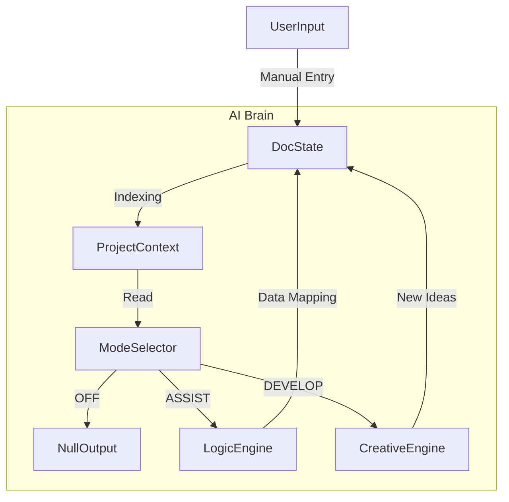

# onFORMAT AI Modes: Implementation Strategy

## Executive Summary
This document outlines the technical and functional strategy for implementing the three distinct AI modes: **OFF**, **ASSIST**, and **DEVELOP**. The core philosophy is **"Contextual Adaptation"**—the AI changes not just its "personality" (prompt) but its permission set, tool access, and UI footprint based on the selected mode.

---

## 1. Mode Definitions & Technical Behavior

### 🔴 OFF Mode (The Passive Observer)
**Philosophy**: "Invisible but Aware."
- **User Experience**: Standard software experience. No chat bubbles, no suggestions, no auto-complete.
- **Technical Implementation**:
  - **LLM Status**: Disconnected / Dormant.
  - **Context Building**: **Passive Indexing**. As the user manually fills forms (e.g., adding a location in a Call Sheet), the application state is updated normally.
  - **Latency Loading**: When the user eventually switches to ASSIST or DEVELOP, the system performs a "Context Hydration" step, reading the current state of the active document and project metadata to prime the AI. It does *not* read continuously in real-time to save tokens, only updating the `ProjectContext` object on save/blur events.

### 🟡 ASSIST Mode (The Librarian)
**Philosophy**: "Assists, does not Insist."
- **Persona**: Efficient, concise, professional, production-focused. No creative fluff.
- **Key Functionality**:
  - **Data Connectivity**: The primary role is the "Conduit." If a user enters a *Shoot Date* in the Schedule, ASSIST mode proactively (but subtly) prepares to update the Call Sheet.
  - **Form Completion**: Specific, field-level assistance. "Fill this based on the Brief."
  - **Proactivity**:
    - *UI Pattern*: **"Suggestion Chips"** or small indicators next to empty fields, rather than intrusive chat messages.
    - *Behavior*: If the AI detects a logical gap (e.g., "Hospital is missing for this location"), it flags it. If the user ignores it, the AI remains silent.
- **Safeguards**:
  - **Temperature**: Low (0.0 - 0.2). Deterministic responses.
  - **Tool Restrictions**: Cannot perform "Generative Ideation" or Web Search unless specifically for factual verification (e.g., sunrise times).

### 🟢 DEVELOP Mode (Magic on Demand)
**Philosophy**: "The Creative Partner."
- **Persona**: Collaborative, knowledgeable, imaginative, capable.
- **Key Functionality**:
  - **Ideation & Research**: Capabilities to search the web (e.g., "Find weather for Rio in July" or "Suggest distinct visual styles").
  - **Bulk Generation**: Can populate entire documents from a high-level prompt. (e.g., "Here is a script, generate a full breakdown and schedule.")
  - **Workflow Bootstrapping**: User starts here to generate the "Skeleton" of a project, then switches to ASSIST to refine the details.
- **Configuration**:
  - **Temperature**: Variable / High (0.7+ for ideation, 0.2 for structuring).
  - **Tool Access**: Full access to Web Search, Image Generation (if applicable), and all Document Write tools.

---

## 2. Technical Architecture: The "Brain"

To achieve this, we need a **Central Context Manager** that sits above the individual documents.

### The `ProjectContext`
A unified JSON object maintained in the state/database that tracks:
1.  **Hard Facts**: Dates, Locations, Cast, Crew (Verified data).
2.  **Soft Context**: Theory, Tone, "Vibe" (derived from DEVELOP conversations).

### Data Flow Diagram

---

## 3. Assessment: What Works & What Doesn't

### What Works (Strong Alignment)
1.  **Separation of Concerns**: Keeping "Creative Drift" out of ASSIST mode is critical for trust. Producers often hate AI because it tries to be "helpful" by inventing things. By strictly lobotomizing the imagination in ASSIST mode, we build a tool professionals can trust.
2.  **The "Librarian" Metaphor**: This is a perfect UX mental model. A librarian finds what you need and puts verification stamps on things; they don't rewrite your book.
3.  **Passive Awareness**: Allowing the AI to "wake up" with context already loaded (from OFF mode) makes the switch to AI seamless.

### What Doesn't Work / Risks (Action Plan)
1.  **"Proactive but Unobtrusive" (The Clippy Risk)**: 
    - *Risk*: If ASSIST mode constantly asks "Do you want me to fill this?", it will be disabled immediately.
    - *Solution*: **Passive Indicators**. Use a subtle visual cue (e.g., a small spark icon) on fields the AI *can* fill. The user must click to accept. The AI never speaks first in the chat unless it's a critical error (e.g., "Date conflict detected").
2.  **"Non-Hallucinatory" Suggestions**:
    - *Risk*: LLMs by nature hallucinate. Asking for "A good beach in Rio" might result in a real beach or a made-up one.
    - *Solution*: **Grounding**. DEVELOP mode *must* have access to a Search Tool (e.g., Google/Bing API) to verify real-world data (Locations, Weather, legal requirements). The AI must cite sources.
3.  **Data Handoff Complexity**:
    - *Risk*: "Handing off to other documents" is technically difficult. If I change a time in the Call Sheet, does it update the Schedule?
    - *Solution*: **Source of Truth**. We need to declare specific documents as "Masters" for certain data types. 
        - *Schedule* = Master of Dates/Times.
        - *Crew List* = Master of Contact Info.
        - ASSIST mode checks the Master before updating dependent docs.

## 4. Proposed Implementation Steps

1.  **Refine System Prompts**: Create three distinct system messages for the AI corresponding to the modes.
2.  **Implement "Entity Extraction"**: When the user works (even in OFF mode), a background process should extract "Entities" (People, Places, Dates) to a shared project database.
3.  **Build the "Spark" UI**: A UI component for ASSIST mode that indicates "AI has a suggestion for this field" without blocking the user.
4.  **Integrate Search Tool**: Connect a search provider for DEVELOP mode validation.
